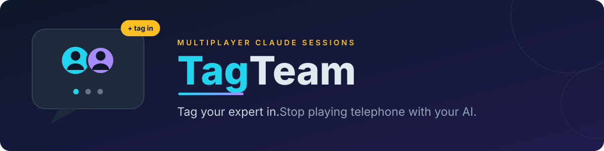
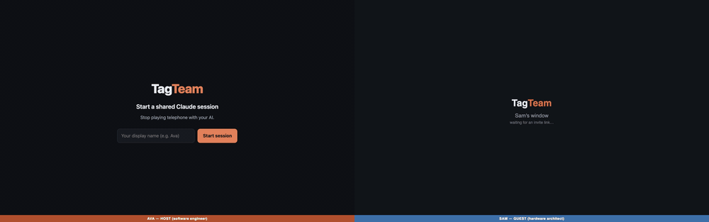
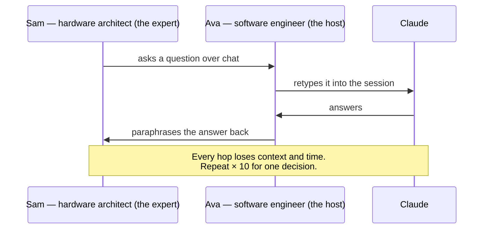
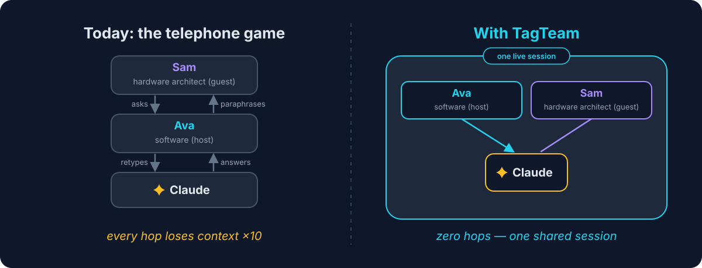
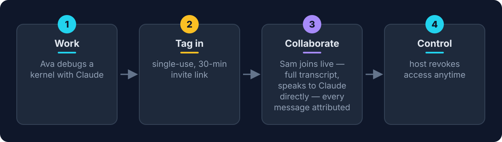
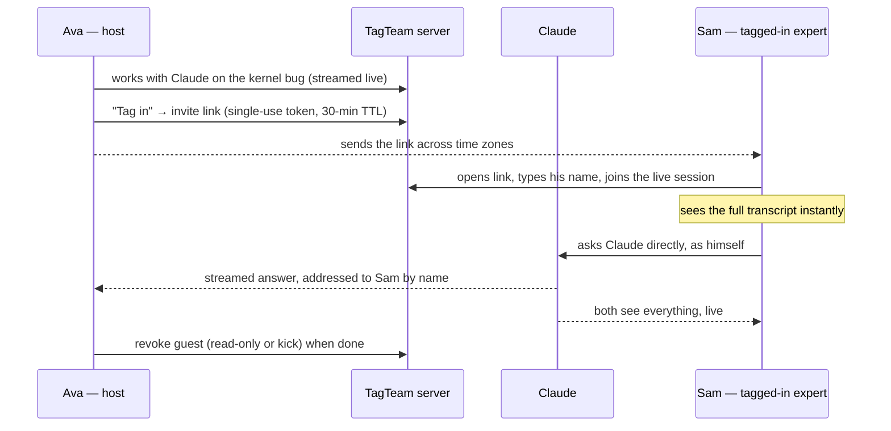
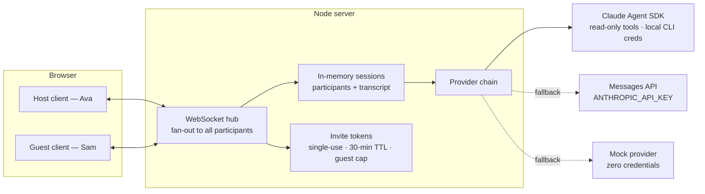

<p align="center">
  
</p>

<h1 align="center">TagTeam</h1>

<p align="center">
  <strong>Tag a colleague into your live Claude session. The expert talks to the AI directly — no relaying, no context loss, no waiting.</strong>
</p>

<p align="center">
  
  
  
  
  
</p>

<p align="center">
  <em>"Stop playing telephone with your AI. Tag your expert in."</em>
</p>

---

## Do you face this too?

- You're mid-flow with your AI when the question crosses into someone else's domain — so you **screenshot the chat into Teams** and wait.
- An expert **dictates questions over a call** while you retype them into your session, then read the answers back to them.
- You've pasted the same AI answer between **three different chats** and lost half the context in every hop.
- A teammate solved this exact problem with AI last week — and **nothing about how** they did it ever reached you.

If any of these are just "Monday" for you, this is the fix.

## See it work — 30 seconds, zero credentials

<p align="center">
  
</p>

<p align="center">
  <em>Ava (left) works the kernel bug with Claude, tags Sam in with a single-use link — Sam (right) joins with the full transcript, asks Claude directly, gets answered by name, and is set to view-only when done. Recorded in mock mode: <code>MOCK_CLAUDE=1 npm start</code>. (<a href="docs/assets/demo.mp4">higher-quality MP4</a>)</em>
</p>

## The Problem

Every team — software, hardware, marketing, sales — now works with AI. But every session is a **silo**: one person's context, one person's prompts, one person's conversation. The moment a task crosses a team boundary, all that AI leverage collapses into a game of telephone.

Meet **Ava**, a software engineer deep in a Claude session, debugging why an inference kernel underperforms on a new accelerator board. Claude holds all the code context. But past a certain point, the answer lives with **Sam** — the senior hardware architect, in another office, in another time zone. Today, getting Sam's expertise into that session looks like this:



<p align="center">
  
</p>

Sam never sees what Claude actually said. Claude never hears what Sam actually asked. Ava spends her afternoon as a lossy human router.

## The Impact

- **Zero-hop expertise across team boundaries.** The hardware expert talks directly to the AI that holds the software context — and vice versa. No paraphrasing, no context loss.
- **Hard-won knowledge moves sideways through the org.** Workflows, prompts, and live working context stop being trapped in one person's browser tab.
- **The session becomes the classroom.** There's a third seat: **Kai**, a junior engineer, can shadow the live session and watch how the seniors actually work a problem — the questions they ask, the dead ends they prune.
- **Afternoons become minutes.** Decisions that took a day of relaying across time zones happen live, in one conversation, with everyone (human and AI) seeing the same thing.

## The Solution

**TagTeam makes Claude sessions multiplayer.** A host works with Claude in a shared session and can **tag in** a colleague via a single-use, 30-minute invite link. The colleague joins the *same live conversation*: full transcript, direct line to Claude, every message attributed by name — so Claude and both humans always know who said what, and Claude addresses each person by name. The host stays in control and can revoke a guest at any moment.

<p align="center">
  
</p>

### The tag-in flow



### Architecture

One Node.js process, in-memory state, no database, no framework, no build step. A static web client drives everything over a single WebSocket protocol.



The provider chain degrades gracefully at startup: **Agent SDK** (real read-only tool use, rides local Claude Code credentials) → **Messages API** (streaming chat via `ANTHROPIC_API_KEY`) → a **clearly-labeled mock** — so the multiplayer demo always runs, even with zero credentials.

### Guardrails — v0 built, v1 designed

| Built now (v0) | Designed, deliberately deferred (v1) |
| --- | --- |
| Single-use invite tokens with 30-min TTL | Real identity / SSO |
| Max 2 guests per session | Context scoping & redaction (what a guest may see) |
| Host can revoke a guest instantly (read-only or kick) | Chat-platform integration — tag in from where you already work |
| Guests cannot mint invites (enforced server-side) | Attach to a local Claude Code CLI session |
| API key never leaves the server | Expertise personas: summon the expert's agent when the human is asleep |

## Try it

**Prerequisites:** [Node.js 20+](https://nodejs.org). That's it — no build step, no database, no framework.

```bash
git clone https://github.com/shashb27/tagteam.git
cd tagteam
npm install
```

<p align="center">
  
</p>

Then pick a run mode. All three serve the app at **http://localhost:3000** (override with `PORT=…`; the server prints the URL on startup).

### 1. Mock mode — recommended for judging (zero credentials)

```bash
MOCK_CLAUDE=1 npm start
```

No API key, no login, nothing to configure. Claude's replies are scripted and **clearly labeled as mock** in the transcript — but every multiplayer mechanic is fully real: live streaming, invite tokens, attribution, revocation. This is the fastest way to see the product work.

### 2. Claude Code login mode (Agent SDK)

```bash
npm start
```

If you're logged into the Claude Code CLI on this machine, the Agent SDK rides your local credentials — no API key needed. Claude gets **read-only tools** (Read/Grep/Glob) scoped to a small demo workspace, so it can do real work in the session. The server probes the SDK at startup and falls back automatically if it's unavailable.

### 3. API-key mode (Messages API)

```bash
ANTHROPIC_API_KEY=sk-ant-... npm start
```

Streaming chat via the Anthropic Messages API. Same multiplayer experience, minus tool use.

> Force a specific backend with `TAGTEAM_AGENT=sdk|api|mock`. The active backend is printed at startup and reported at `/healthz`.

### The two-browser walkthrough

1. **Open http://localhost:3000** in browser window #1. Click **New session** — you're the host. Enter as **Ava**.
2. **Chat with Claude** about the demo scenario: debugging a kernel regression on the new accelerator board. Watch the response stream in.
3. Click **Tag in** → an invite link appears (single-use, expires in 30 minutes). **Copy it.**
4. **Open the link in browser window #2** (or an incognito window). Type **Sam** at the name prompt — you're in, with the full transcript already on screen.
5. As Sam, **ask Claude a question directly** — no relaying through Ava.
6. Watch Claude **answer Sam by name**, streamed live to both windows simultaneously.
7. Back in the host window, **revoke Sam** (make read-only, or kick). Sam can no longer send — the guardrails are server-enforced, not UI decoration.

## Repo map

| Path | What it is |
| --- | --- |
| `server/` | Node ESM backend: HTTP + WebSocket hub, in-memory sessions & tokens, turn engine, provider chain (`server/agent/`) |
| `web/` | Static frontend (one HTML page + vanilla JS/CSS) — no framework, no build |
| `docs/design/` | One design doc per swarm specialist: architecture & wire protocol, backend, frontend, product, security |
| `docs/PITCH.md` | The pitch narrative |
| `DEMO.md` | The 3-minute demo script |
| `PROJECT_BRIEF.md` | The contract: scope, guardrails, success criteria |

## The meta-story

This POC was designed and built by a **six-agent swarm**: five specialists (product, architecture, backend, frontend, security) plus a **resident critic** whose only job is to find what the others got wrong — orchestrated through a design → critique → build → integrate loop that ends only on a **unanimous approval vote** by all six.

The design docs in `docs/design/` are the agents' actual working contracts, written independently and reconciled through critique. Collaboration between intelligences — human and AI — is both the product and the process.
