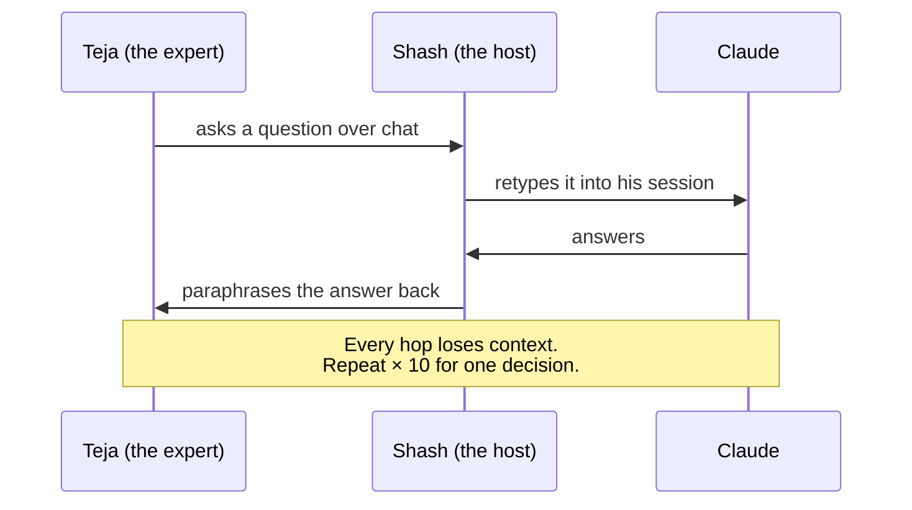
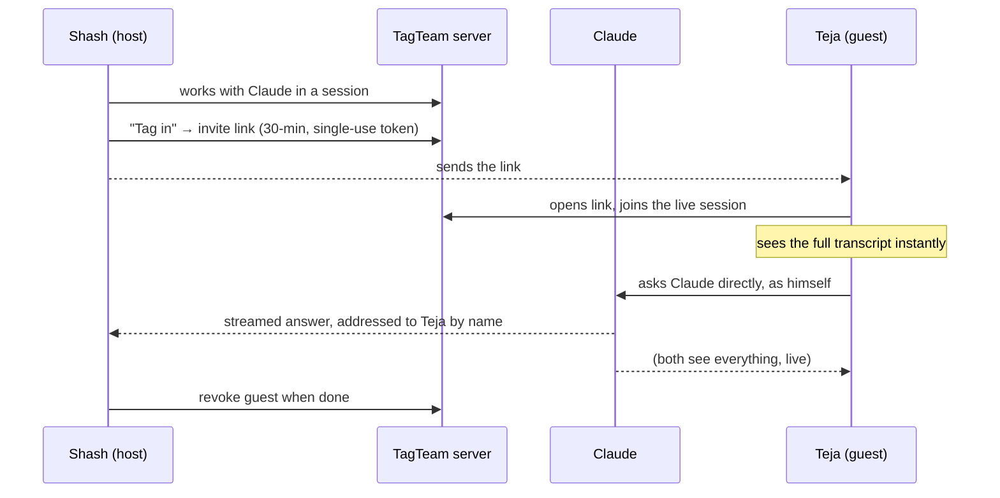
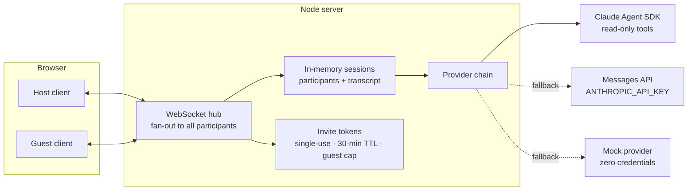

# TagTeam — stop playing telephone with your AI

**Tag a colleague into your live Claude session. The expert talks to the AI directly — no relaying, no context loss, no waiting.**

---

## The problem (a true story)

Shash, a product lead, is deep in a Claude session working through TPU procurement.
Past a certain point he needs Teja from IT. Today that looks like this:

Every team — software, hardware, marketing, sales — has this problem. Everyone uses AI,
but each person's session is a **silo**. Expertise can't step into the room where the work
is actually happening.

## The idea

TagTeam makes an AI session **multiplayer**. The host clicks **Tag in**, sends a
time-boxed invite link, and the expert joins the *same live conversation* — full
transcript, direct line to Claude, every message attributed by name.

## Why it matters

- **Zero-hop expertise.** The person who knows the answer talks to the AI that has the
  context. Decisions that took an afternoon of relaying take minutes.
- **Knowledge moves sideways.** A junior can be tagged into a senior's session and watch
  how the problem actually gets worked — the session becomes the classroom.
- **It meets people where they already are.** No new tool to learn: it's the same AI
  conversation, just with the right people in it.

## How it's built

Plain Node.js + a static web client. **No build step, no database, no framework** —
`npm install && npm start` is the entire setup. The provider chain degrades gracefully:
Agent SDK → API key → a clearly-labeled mock mode, so the demo runs with zero credentials.

## Guardrails — v0 now, v1 next

| Now (built) | Next (designed, deferred) |
| --- | --- |
| Single-use invite tokens, 30-min TTL | Real identity / SSO |
| Max 2 guests per session | Context scoping & redaction (what a guest may see) |
| Host can revoke a guest instantly | Teams integration — tag in from where you already chat |
| Guests cannot mint invites | Attach to local Claude Code CLI sessions |
| API key never leaves the server | Expertise personas: summon "Agent Teja" when the human is asleep |

## The meta-story: built by the thing it demonstrates

This POC was designed and built by a **six-agent swarm**: five specialists (product,
architecture, backend, frontend, security) plus a **resident critic** whose only job is to
complain, orchestrated through design → critique → build → integrate → a formal approval
vote by all six. Collaboration between intelligences — human and AI — is both the product
and the process.

---

*Hackathon POC by Shash Bhaskar. See `README.md` to run it and `DEMO.md` for the 3-minute demo script.*
